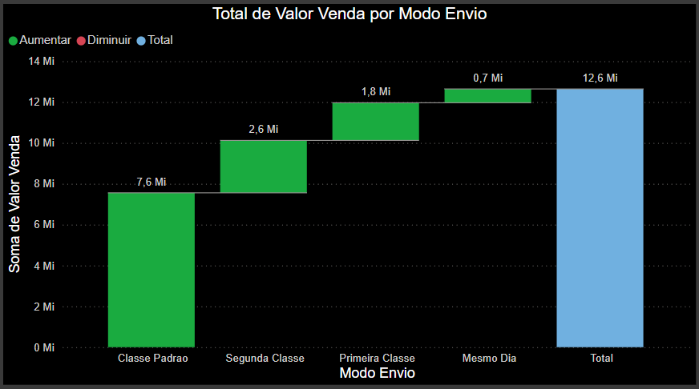
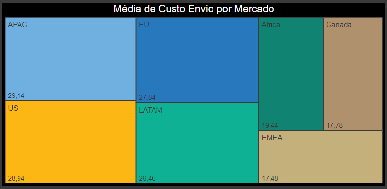
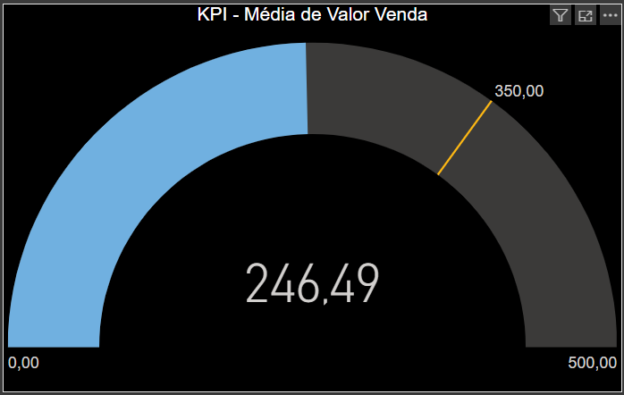
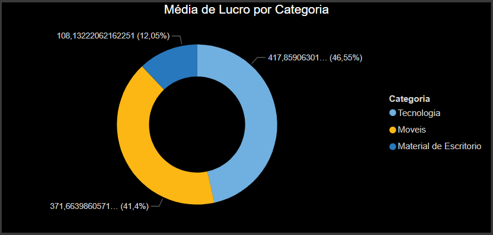
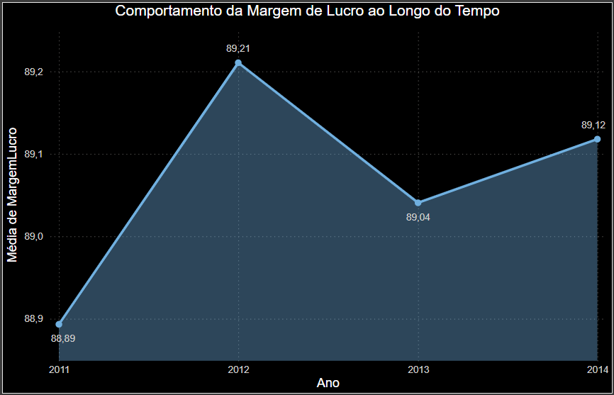

# Análise de Dados de Vendas, Custo, Margem de Lucro e KPI
Este Dashboard foi criado através do curso gratuito da Data Science Academy de Microsoft Power BI Para Business Intelligence e Data Science, utilizando dados fictícios para a criação de um Dashboard Analítico de Vendas, Custo, Margem de Lucro e KPI.

## Objetivo

O objetivo deste dashboard é fornecer uma visão abrangente das vendas e logística, respondendo às seguintes perguntas:

1. **Qual foi o total de valor de venda considerando cada modo de envio dos pedidos?**

   - Visualização: Gráfico de Cascata
   - Descrição: Este gráfico de cascata ilustra o total de valor de venda segregado por diferentes modos de envio, permitindo uma análise clara das contribuições individuais de cada método de entrega.
   - 

2. **Quais mercados tiveram o maior custo médio de envio dos produtos vendidos?**

   - Visualização: Gráfico Treemap
   - Descrição: Aqui, um gráfico Treemap destaca os mercados que incorreram nos maiores custos médios de envio, proporcionando uma visão detalhada sobre os mercados mais onerosos em termos de logística.
   - 

3. **A empresa ficou abaixo ou acima da meta de valor de venda no mês de Abril/2014?**

   - Visualização: Indicador de KPI
   - Descrição: Este KPI exibe o valor médio de venda comparado com a meta de 350. Especificamente, ele mostra se a meta foi atingida ou não em Abril/2014, facilitando o monitoramento do desempenho mensal de vendas.
   -      

4. **Qual categoria de produto apresentou maior lucro médio?**

   - Visualização: Gráfico de Rosca
   - Descrição: Este gráfico compara as categorias de produto com base no lucro médio, destacando qual delas foi a mais lucrativa.
   -  

5. **Qual foi o comportamento da margem de lucro ao longo do tempo?**

   - Visualização: Gráfico de Linhas
   - Descrição: O gráfico de linhas mostra a evolução da margem de lucro ao longo do tempo, proporcionando uma análise temporal do desempenho financeiro da empresa.
   - 

## Funcionalidades do Dashboard

   - **Filtragem de Dados:** O usuário pode filtrar os dados por ano, segmento e país para obter insights específicos.
   - **Visualizações Interativas:** Gráficos e mapas interativos que permitem uma análise detalhada dos dados de vendas e logística.

## Visualizações e Insights
1. **Total de Valor de Venda por Modo de Envio:**
   - Exibe o valor total de vendas realizadas por cada modo de envio.

2. **Mercados com Maior Custo Médio de Envio:**
   - Gráfico de cascata mostrando os mercados com maiores custos médios de envio.

3. **Indicador de Desempenho de Valor de Venda:**
   - KPI exibindo se a meta de valor de venda foi atingida no mês de Abril/2014.

4. **Lucro Médio por Categoria de Produto:**
   - Gráfico comparativo destacando a categoria de produto com maior lucro médio.

5. **Comportamento da Margem de Lucro ao Longo do Tempo:**
   - Gráfico de linha ilustrando a evolução da margem de lucro ao longo do tempo.

## Como Utilizar
1. **Filtre os Dados:**
   - Utilize os filtros disponíveis para selecionar o ano, segmento e país de interesse.

2. **Interaja com os Gráficos:**
   - Clique nos gráficos para obter detalhes específicos e visualizar os dados de diferentes perspectivas.

## Conclusão

Este dashboard fornece uma análise detalhada das vendas e logística, permitindo identificar padrões, tendências e insights valiosos para tomada de decisão. Com ele, é possível entender melhor o desempenho de vendas por categoria de produto, modo de envio, mercados e outras dimensões relevantes.

---

[Cursos na Data Science Academy](https://www.datascienceacademy.com.br)
